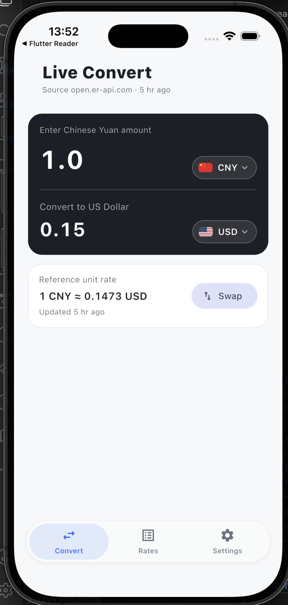
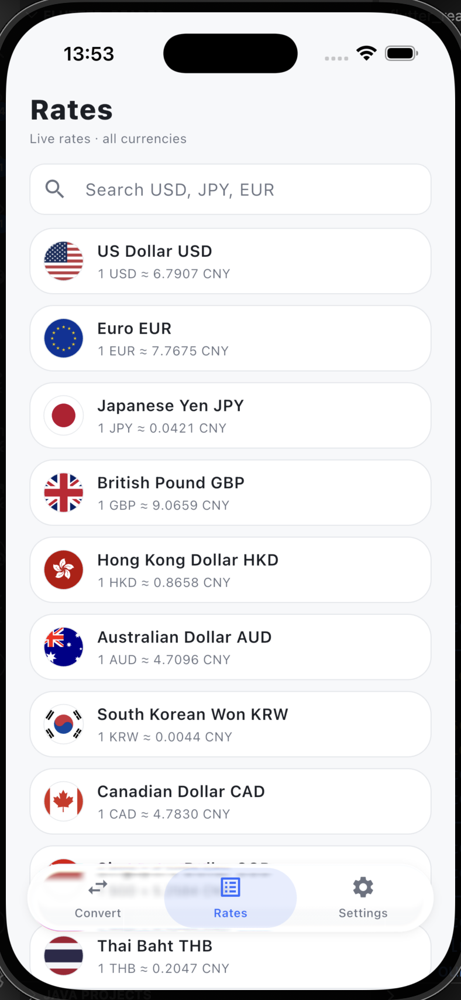
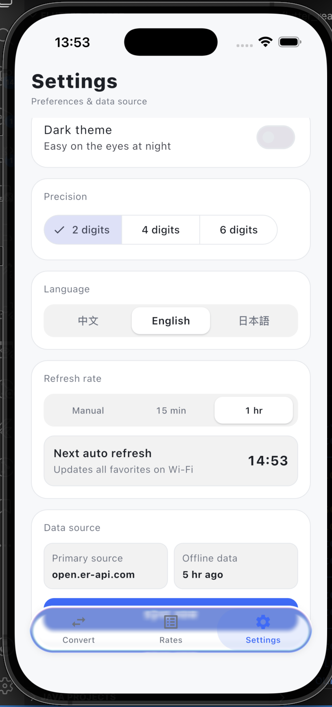

# exchange_rate · Currency Converter

English | [简体中文](README.md)

A currency converter built on live exchange rates, converting any currency ↔ any currency at the day's rate. It ships with three screens — live conversion, multi-currency rates, and settings — featuring a Liquid Glass bottom navigation bar, three UI languages (中文 / English / 日本語), and light/dark themes.

> This project was developed entirely with [Claude Code](https://www.anthropic.com/claude-code), and the UI is built consistently with Open Design.

## Screenshots

| Live Convert | Rates | Settings |
| :---: | :---: | :---: |
|  |  |  |

## Features

- **Live convert**: Enter an amount and convert between any base and target currency; one-tap direction swap, quick currency switching, and pull-to-refresh.
- **Multi-currency rates**: Shows every currency's rate against the current base (CNY by default), with live search filtering by code or name, plus pull-to-refresh.
- **Multilingual**: Instant switching between 中文 / English / 日本語. All ~160 currencies carry names in all three languages, so both UI copy and currency names localize together. The language preference is persisted locally.
- **Settings**: Language switch, dark theme toggle, conversion precision (2 / 4 / 6 digits), and auto-refresh interval (manual / 15 min / 1 hr) — all persisted locally.

## Architecture (MVC)

```
lib/
├── main.dart              # GetMaterialApp entry (translations, locale, theme)
├── core/                  # Theme, routes, Dio client, constants, currency meta, i18n catalog
├── models/                # Currency value object, ExchangeRateTable (cross-rate math)
├── repositories/          # RateRepository: fetch + cache + same-day validity + offline fallback
├── controllers/           # Converter / Rates / Settings GetxControllers
├── bindings/              # AppBinding: GetX dependency injection
└── views/                 # home (bottom-nav shell) / converter / rates / settings
```

- **Model**: `ExchangeRateTable` stores the `rates` map against USD; cross rates are computed as `rate(A→B) = usdRates[B] / usdRates[A]`, enabling any-to-any conversion.
- **View**: GetX reactive pages (`Obx`) matching the design spec (accent `#2F6BFF`, large rounded cards, tabular figures for numbers, Liquid Glass bottom bar, light/dark themes).
- **Controller**: `ConverterController` / `RatesController` / `SettingsController`, with business state held in `.obs`.

## Internationalization (i18n)

- Built on GetX's `Translations` + `.tr`; the catalog lives in `lib/core/app_translations.dart` and supports `zh_CN` / `en_US` / `ja_JP`.
- Switching language calls `Get.updateLocale`, rebuilding the UI live — no restart required.
- Currency names follow the language: the `Currency` model carries `cnName` / `enName` / `jaName` and resolves the active name via `nameFor(localeKey)`, falling back gracefully when a name is missing.

## Data Source

- API: `https://open.er-api.com/v6/latest/USD` (no API key required; returns USD-based `rates` and `time_last_update_unix`).
- **Same-day rates**: Reuses cached data when it's from the current day; refetches across day boundaries or on forced refresh.
- **Offline fallback**: On network failure with an existing cache, falls back to the last successful fetch.

## Tech Stack

- Flutter 3.11+ / Dart 3
- [GetX](https://pub.dev/packages/get) — state management + routing + DI + i18n
- [Dio](https://pub.dev/packages/dio) — networking (wrapped in `ApiClient`)
- [get_storage](https://pub.dev/packages/get_storage) — local cache & preference persistence
- [country_flags](https://pub.dev/packages/country_flags) — currency flag icons
- [liquid_glass_widgets](https://pub.dev/packages/liquid_glass_widgets) — glassy bottom navigation bar
- [intl](https://pub.dev/packages/intl) — number/date formatting

## Getting Started

This project uses [fvm](https://fvm.app/) to pin the Flutter version, so commands are prefixed with `fvm`:

```bash
fvm flutter pub get      # install dependencies
fvm flutter run          # run on a device/simulator
fvm flutter test         # run all tests
fvm flutter analyze      # static analysis
```

> Not using fvm? Drop the `fvm` prefix and run `flutter ...` directly.

## Tests

Unit tests cover cross-rate math, the repository's cache/offline strategy, and all three controllers' logic; widget tests cover the key interactions on all four screens plus multilingual rendering.

## License

[MIT](LICENSE)
